**Barcodify** is a powerful JavaFX application developed exclusively for an enterprise client, tailored to meet their unique specifications. It provides extensive customization options, allowing users to adjust every element — from color schemes and font sizes to margins and barcode dimensions to suit their needs.  

The application currently supports eight types of linear barcodes:
- Code39
- Code128
- Codabar
- Interleaved 2 of 5
- UPC-A
- UPC-E
- EAN-8
- EAN-13  

Its core feature is an advanced template configuration system, which allows users to create, save and reuse the templates. The magic of Barcodify is its  _intelligent bundling and alignment system_. No matter how many rows or columns you have, the application intelligently bundles and aligns barcodes based on the specified bundle size (if selected) and batchSize. It generates barcodes incrementally (based on batchSize), with each column processed concurrently. 

#### Key Features

- **Full Customization:** Adjust color schemes, fonts, margins, and barcode dimensions.
- **Enhanced Performance**: Faster generation, reduced memory usage, and an improved UI.
- **Template Management**: Easily create, save, and export templates for future barcode generation.
- **Intelligent Bundling and Concurrent Processing**: Automatically bundles and aligns barcodes based on user specifications, efficiently generating barcodes in batches with concurrent column processing.

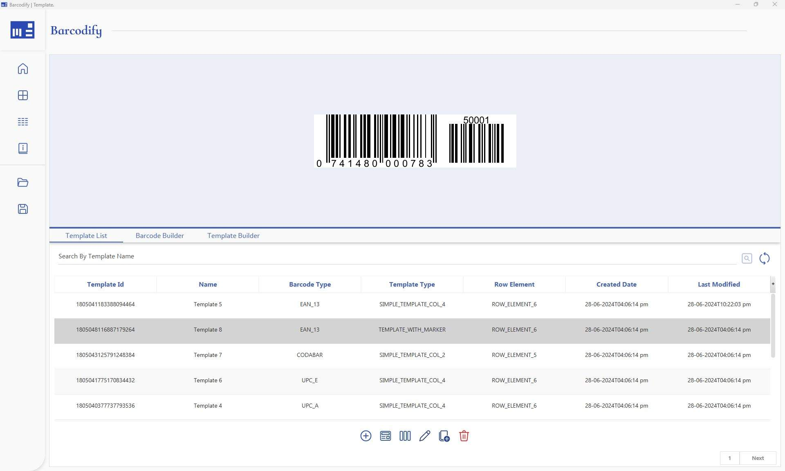

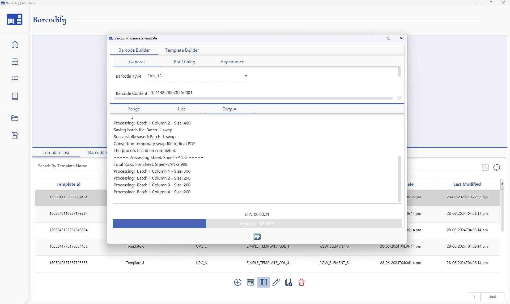

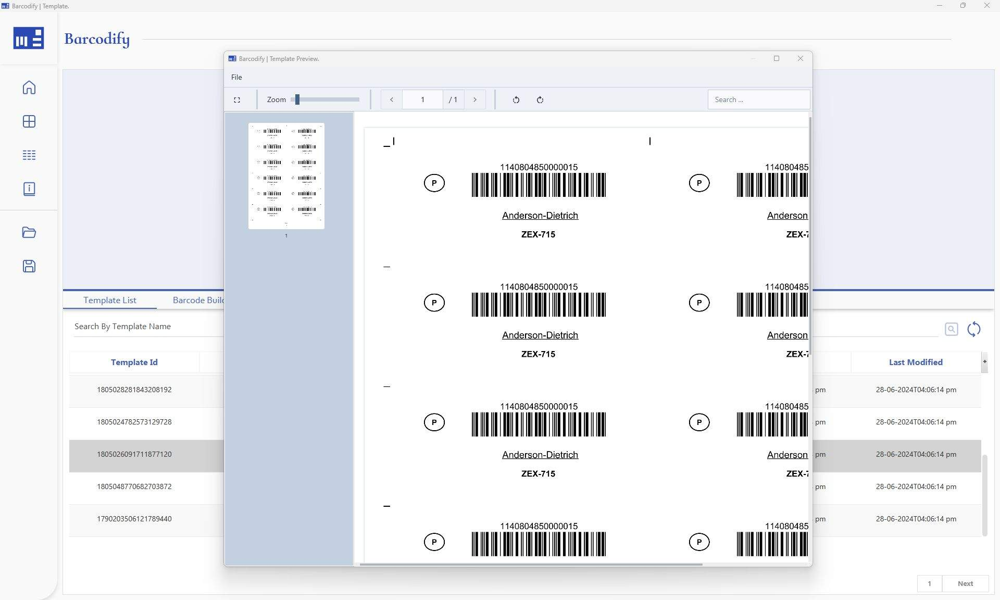

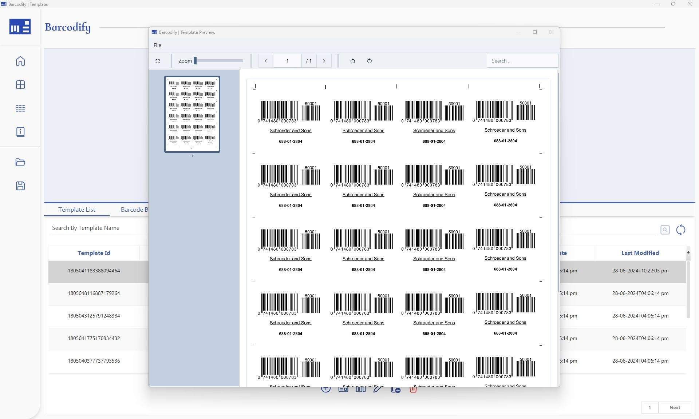

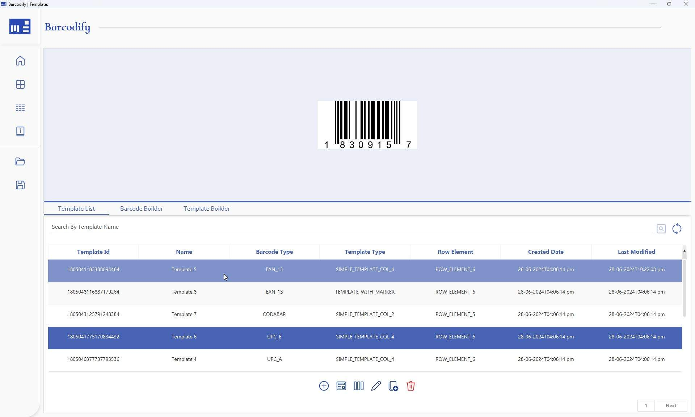

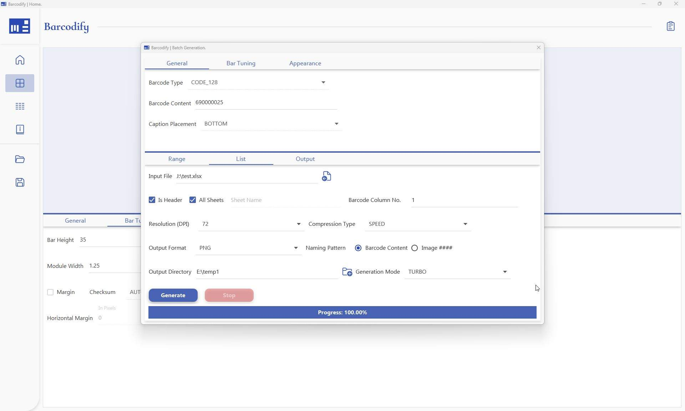

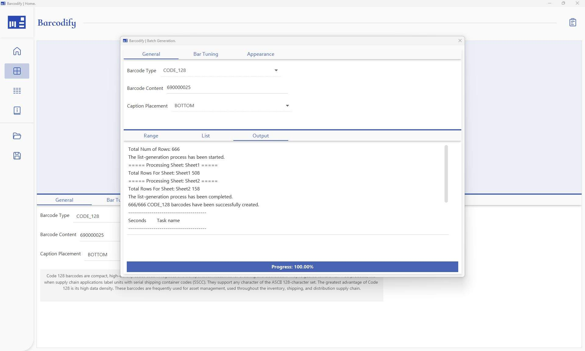

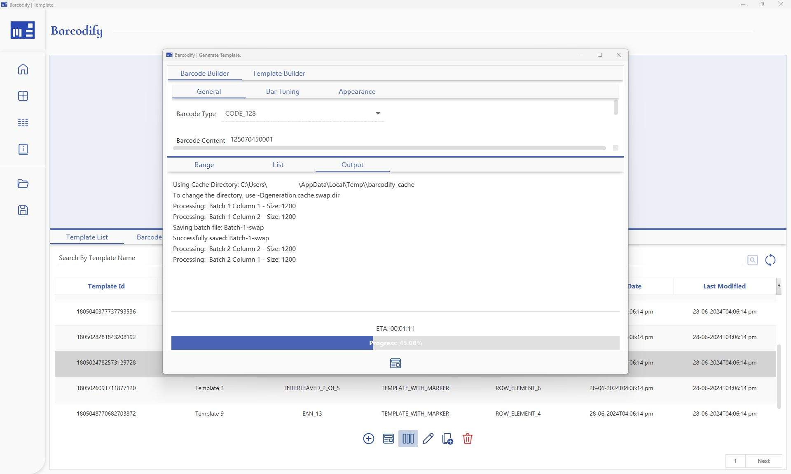

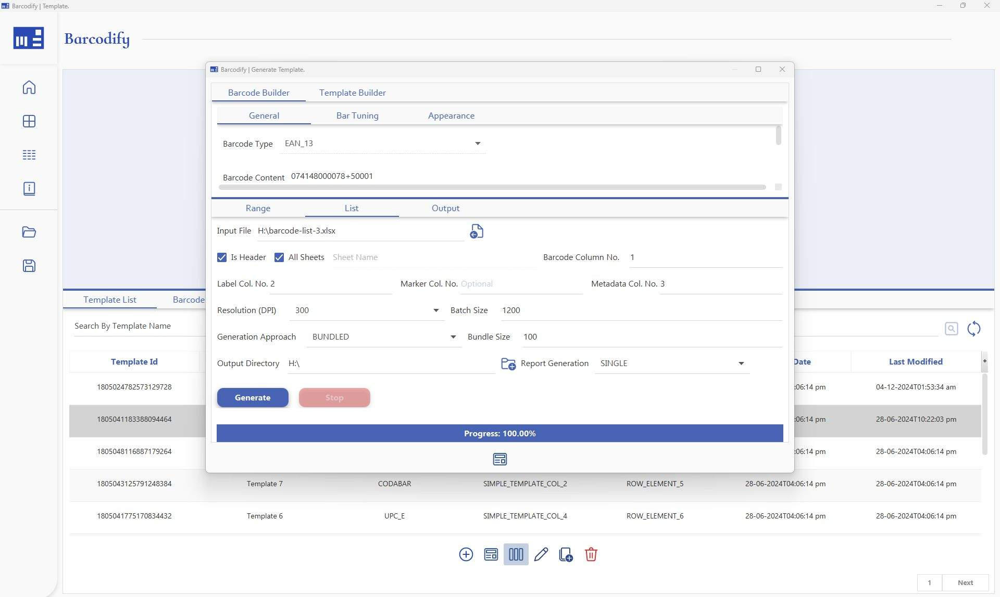

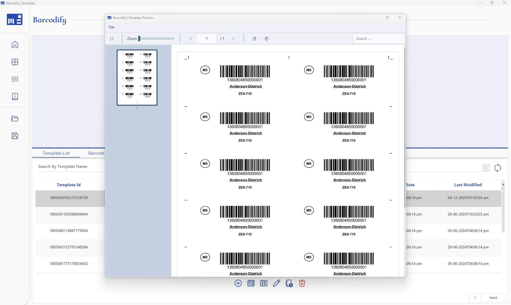

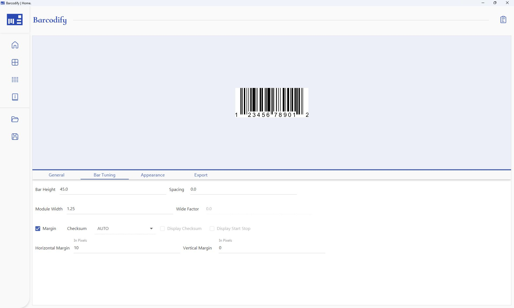